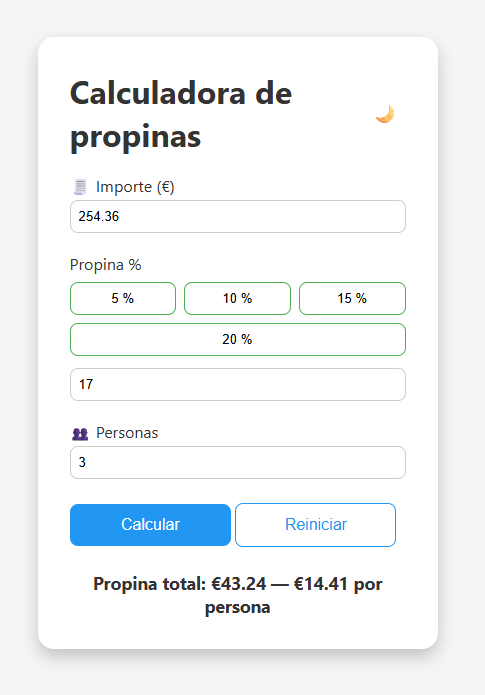
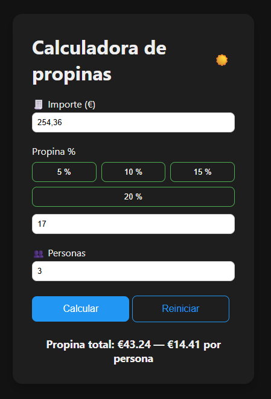
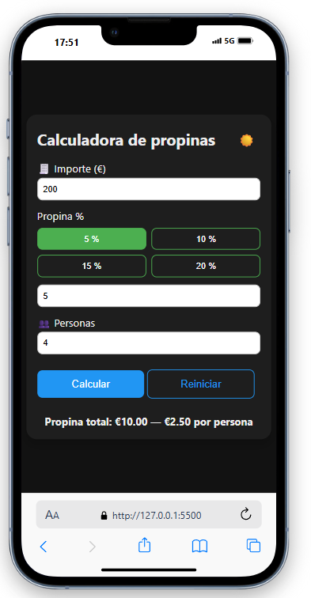
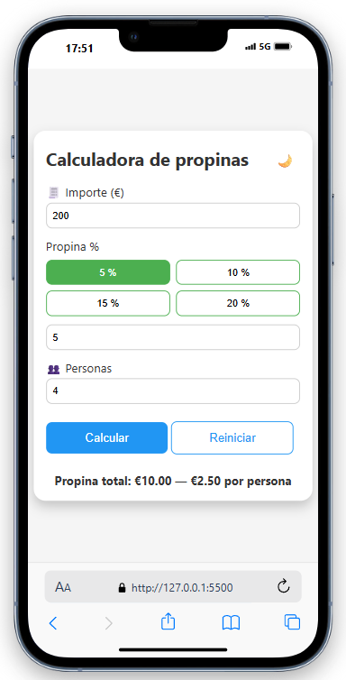

# Vanilla JS Tip Calculator

Una calculadora de propinas desarrollada con **JavaScript puro**, HTML y CSS, para repasar fundamentos sin frameworks.

## 📂 Estructura

- `index.html` - punto de entrada y estructura HTML.
- `src/css/styles.css` - estilos modernos con variables CSS y diseño responsive.
  - 🔗 [Ver carpeta `src/`](https://github.com/saulvg/vanilla-tip-calculator/tree/main/src/css/styles.css)
- `src/js/app.js` - lógica completa de la calculadora en módulo ES6.
  - 🔗 [Ver carpeta `src/`](https://github.com/saulvg/vanilla-tip-calculator/tree/main/src/js/app.js)
- `assets/` – capturas de pantalla (PNG) para documentación.

## ⚙️ Tecnologías

- HTML5
- CSS3
- JavaScript (ES6+)

## 🚀 Uso local

1. Clona el repositorio:

   ```bash
   git clone https://github.com/tu-usuario/tip-calculator.git
   ```

2. Entra en la carpeta:

   ```bash
   cd tip-calculator
   ```

3. Abre `index.html` en tu navegador o usa una extensión de live-server en VS Code.

## 📱 / 🖥️ Capturas

### 🖥️ Vista Desktop

<p align="center">
  
</p>

<p align="center">
  
</p>

### 📱 Vista Móvil

<p align="center">
  
</p>

<p align="center">
  
</p>
